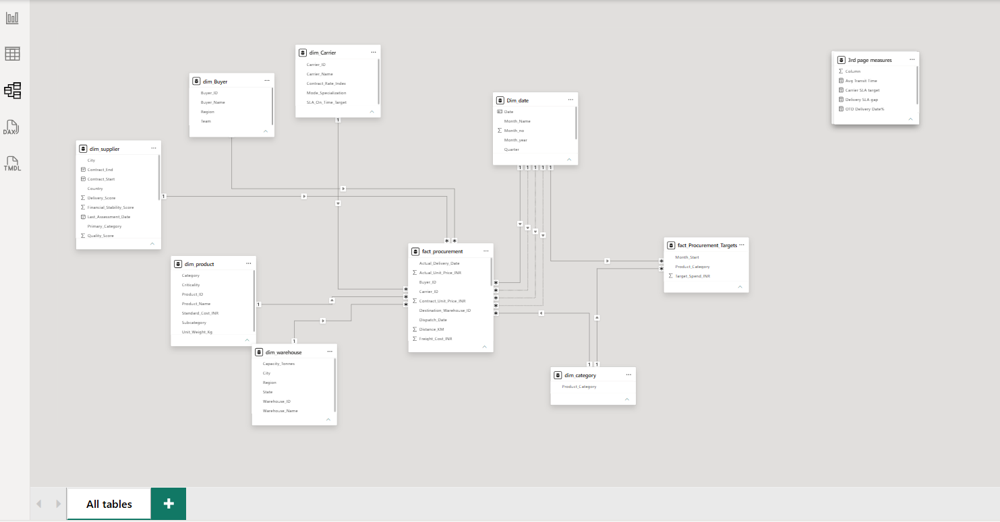
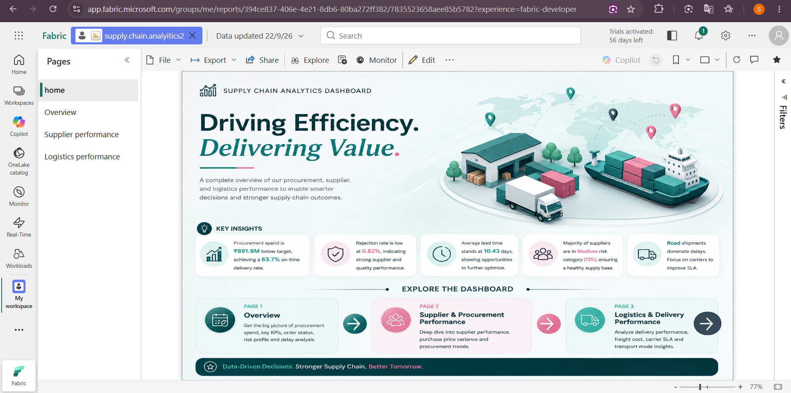
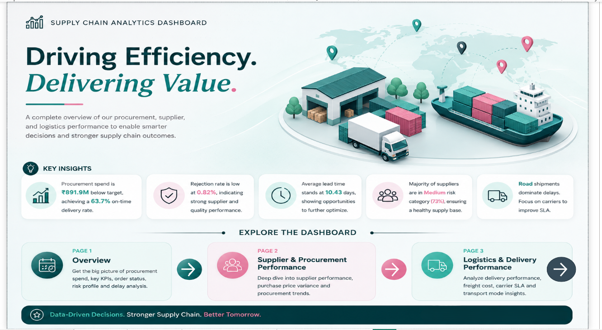
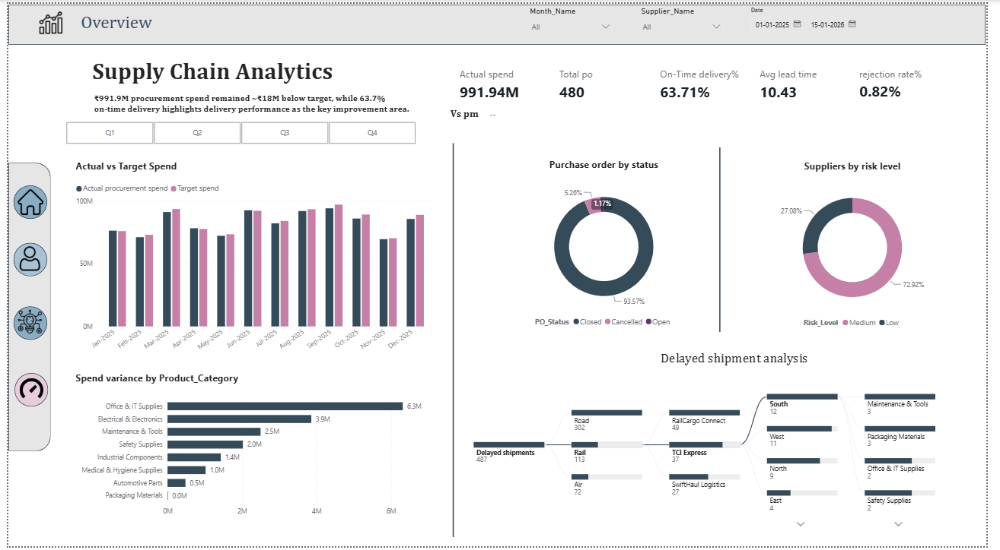
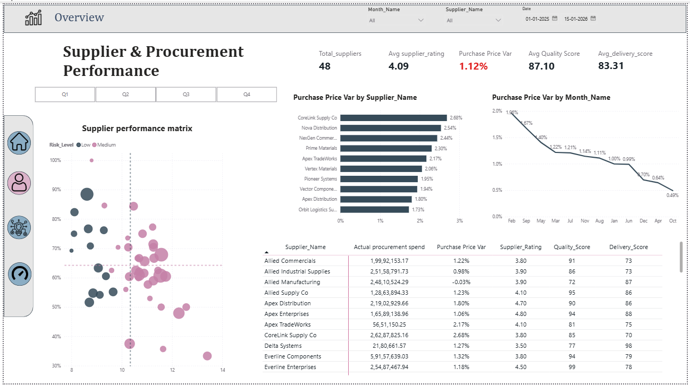
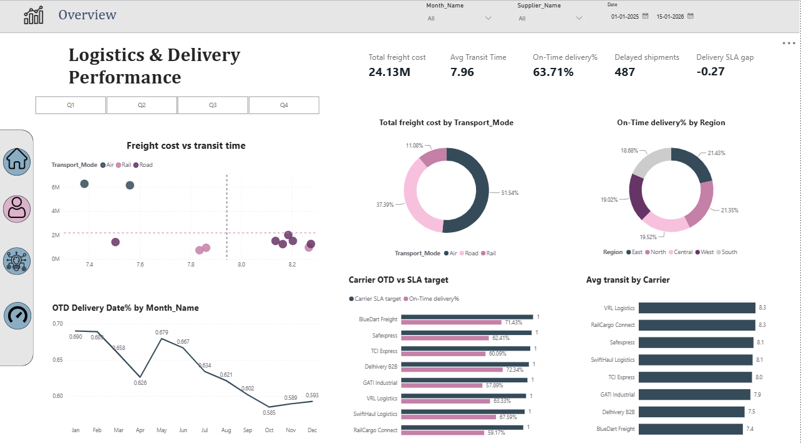

# Supply Chain Analytics report

A 3-page interactive Power BI report analyzing **procurement, supplier, and logistics performance** — built to bring scattered supply chain data into one clean view for faster, data-driven decisions.

📊 **Report (PPT):** `report/Supply_Chain_Analytics_Report.pptx`
📁 **Power BI file:** `powerbi-file/supply-chain-report.pbix`

---

## Repository Structure

```
supply-chain-analytics-powerbi/
├── README.md
├── Data/
│   └── Supply_Chain_Procurement.xlsx
├── powerbi-file/
│   └── supply-chain-report.pbix
├── screenshots/
│   ├── data-model.png
│   ├── home-landing.png
│   ├── overview.png
│   ├── supplier-performance.png
│   ├── logistics-performance.png
│   └── power-bi-service.png
└── report/
    └── Supply_Chain_Analytics_Report.pptx
```

---

## Overview

Procurement and logistics teams often work across disconnected sources — purchase orders, supplier master data, shipments, carrier data, warehouse data, and monthly targets — making it hard to answer simple questions like *"Are we on budget?"* or *"Which carrier is causing our delays?"*

This dashboard brings all of that into a single 3-page Power BI report covering:

1. **Overview** — spend vs target, PO status, supplier risk, delayed shipment root-cause
2. **Supplier & Procurement Performance** — supplier ratings, purchase price variance, quality/delivery scores
3. **Logistics & Delivery Performance** — freight cost, transit time, carrier SLA performance

---

## Tools Used

- **Power BI Desktop** — data modeling, report building
- **Power Query (M)** — data cleaning and transformation
- **DAX** — KPI measures and calculations

---

## Data Source

Built on a **synthetic dataset** designed to simulate realistic supply chain patterns (lead time variance, SLA performance, rejection rates, procurement spend cycles). Real company procurement/logistics data is confidential, so a synthetic dataset let me practice modeling and DAX logic on business-realistic numbers without needing internal company access.

---

## Data Model

A **galaxy schema** with two fact tables sharing conformed dimensions, so actual-vs-target comparisons stay accurate:

**Fact tables**
- `fact_procurement` — transaction-level procurement data
- `fact_Procurement_Targets` — category-month level spend targets

**Dimension tables**
- `dim_supplier`, `dim_Carrier`, `dim_product`, `dim_category`, `dim_warehouse`, `dim_Buyer`, `Dim_date`

DAX measures are organized into **dedicated per-page measure tables** rather than scattered across the model, keeping the report easy to navigate and maintain.



---

## Key DAX Measures

| KPI | Core Logic | Why It Matters |
|---|---|---|
| On-Time Delivery % | On-time delivered shipments ÷ total delivered shipments | Delivery reliability |
| Purchase Price Variance % | (Actual spend − Contract spend) ÷ Contract spend | Pricing control |
| Rejection Rate % | Rejected quantity ÷ Received quantity | Quality leakage |
| Avg Lead Time | Order date → actual delivery date | Procurement speed |
| Spend Variance | Target spend − Actual spend | Budget tracking |
| Freight Cost | Sum of transport cost across carriers | Logistics cost control |
| SLA Gap | Actual OTD % − Carrier SLA target | Carrier accountability |

---

---

## Published to Power BI Service

The report is also published to Power BI Service (Microsoft Fabric), confirming it works as a live, interactive dashboard beyond just the desktop file.



---

## Dashboard Preview

### Landing Page
Navigation hub with headline KPIs and a one-line summary.



### Page 1 — Overview


- ₹991.9M procurement spend, ~₹18M below target
- 63.71% on-time delivery — the clearest improvement area
- 480 total POs; only 1.17% cancelled
- 72.9% of suppliers sit in the Medium risk band
- Decomposition tree traces 487 delayed shipments down to Road → Rail Cargo Connect → South region

### Page 2 — Supplier & Procurement Performance


- 48 active suppliers, avg rating 4.09/5
- Purchase Price Variance at 1.12%, trending down since February
- Scatter matrix plots quality score against lead time, colored by risk level
- Avg quality score 87.1, avg delivery score 83.3

### Page 3 — Logistics & Delivery Performance


- ₹24.13M total freight cost; Road carries 51.5% of it
- Avg transit time 7.96 days across all modes
- Delivery SLA gap of -0.27 — carriers missing committed SLA targets on average
- BlueDart Freight and Delhivery B2B post the strongest OTD% against target

---

## Key Insights & Business Impact

- **₹18M below target spend**, despite ₹991.9M in total procurement
- **63.7% on-time delivery** — flagged as the priority improvement area
- **0.82% rejection rate** — strong supplier quality control
- **72.9% of suppliers** rated Medium risk, not yet Low
- **487 delayed shipments**, concentrated in Road transport
- **-0.27 avg SLA gap** — carriers under-delivering vs. committed targets

---

## Challenges

- No access to real company data — built a realistic synthetic dataset simulating true supply chain patterns instead
- Connecting two fact tables at different grains (transaction vs. category-month) without inflating totals — solved with conformed dimensions rather than merging tables
- Balancing analytical depth with a report that stays explainable to a non-technical viewer

## Next Steps

- Connect to a live/larger dataset with incremental refresh
- Add row-level security so each supplier sees only their own performance
- Add a simple forecast visual for spend and delivery trends
- Publish to Power BI Service with a scheduled refresh for a live demo link

---

## Connect

- **GitHub:** [github.com/sumeet582004](https://github.com/sumeet582004)
- **LinkedIn:** [linkedin.com/in/sumit-kale-773704261](https://www.linkedin.com/in/sumit-kale-773704261)
